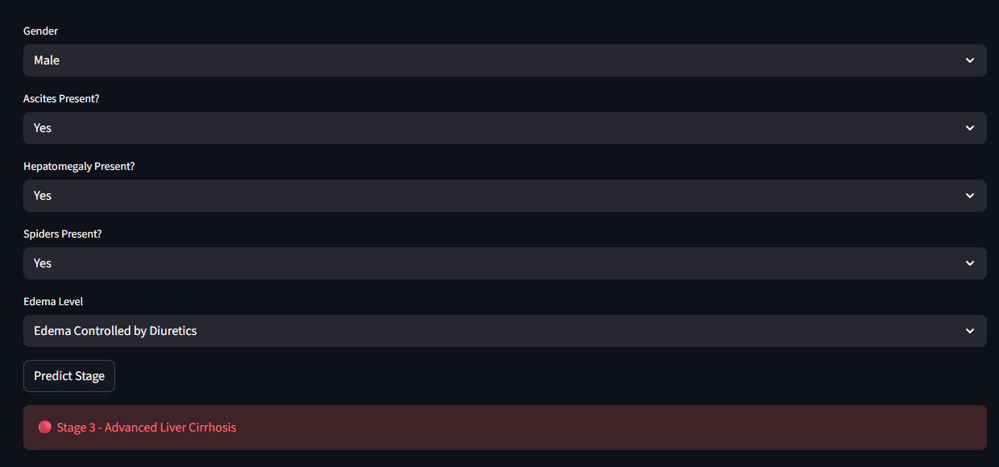

# 🧪 Liver Cirrhosis Stage Detection System



The Liver Cirrhosis Stage Detection System is a Machine Learning application that predicts the stage of liver cirrhosis based on patient demographic, clinical, and laboratory test data. The system analyzes various liver-related health indicators to determine the severity of liver damage and classify patients into different stages of cirrhosis.

The project uses a Random Forest Classifier trained on a liver cirrhosis dataset and provides predictions through an interactive Streamlit web application.

## 🎯 Objectives

* Analyze liver cirrhosis patient data using Exploratory Data Analysis (EDA).
* Build a machine learning model for liver cirrhosis stage classification.
* Evaluate model performance using classification metrics.
* Deploy the model using Streamlit for real-time predictions.

## 📊 Dataset Features

| Feature       | Description                                           |
| ------------- | ----------------------------------------------------- |
| N_Days        | Number of days between registration and study outcome |
| Status        | Patient status (Censored, Liver Transplant, Death)    |
| Drug          | Type of drug administered                             |
| Age           | Age of patient in days                                |
| Sex           | Male or Female                                        |
| Ascites       | Presence of ascites                                   |
| Hepatomegaly  | Presence of hepatomegaly                              |
| Spiders       | Presence of spider angiomas                           |
| Edema         | Edema severity                                        |
| Bilirubin     | Serum bilirubin level (mg/dl)                         |
| Cholesterol   | Serum cholesterol level (mg/dl)                       |
| Albumin       | Albumin level (gm/dl)                                 |
| Copper        | Urine copper level (ug/day)                           |
| Alk_Phos      | Alkaline phosphatase (U/liter)                        |
| SGOT          | Liver enzyme SGOT (U/ml)                              |
| Tryglicerides | Triglycerides level (mg/dl)                           |
| Platelets     | Platelet count                                        |
| Prothrombin   | Prothrombin time (seconds)                            |

### Target Variable

| Variable | Description                         |
| -------- | ----------------------------------- |
| Stage    | Histologic stage of liver cirrhosis |

* 1 = Early Stage Cirrhosis
* 2 = Moderate Stage Cirrhosis
* 3 = Advanced Stage Cirrhosis

## 🤖 Machine Learning Model

### Model Used

```python
RandomForestClassifier(
    n_estimators=100,
    random_state=42
)
```

## 📈 Model Performance

### Accuracy

```text
87.29%
```

### Classification Report

```text
Precision: 87%
Recall: 87%
F1-Score: 87%
```

### Class-wise Performance

```text
Stage 1
Precision = 0.87
Recall = 0.85
F1-Score = 0.86

Stage 2
Precision = 0.83
Recall = 0.85
F1-Score = 0.84

Stage 3
Precision = 0.91
Recall = 0.91
F1-Score = 0.91
```

### Key Findings

* The dataset contains clinical and laboratory records of liver cirrhosis patients.
* Missing values were identified and handled appropriately.
* Bilirubin, Albumin, Copper, Platelets, and Prothrombin were among the most influential features.
* Stage 3 patients showed more severe laboratory abnormalities.
* Random Forest achieved strong multiclass classification performance with an accuracy of 87.29%.

## 🛠️ Technologies Used

* Python
* Pandas
* NumPy
* Matplotlib
* Seaborn
* Scikit-learn
* Joblib
* Streamlit

## 📁 Project Structure

```text
Liver Cirrhosis Stage Detection/
│
├── app.py
├── cirrhosis_model.pkl
├── Livercirrhosis.ipynb
├── liver_cirrhosis.csv
├── requirements.txt
├── README.md
└── Image.png
```

### Clone Repository

```bash
git clone https://github.com/malshiprabodha/Liver-Cirrhosis-Stage-Detection.git
cd Liver-Cirrhosis-Stage-Detection
```

### Install Dependencies

```bash
pip install -r requirements.txt
```

### Run Application

```bash
streamlit run app.py
```


## 🌐 Live Demo

```text
https://malshiprabodha-liver-cirrhosis-stage-detection-app-r9ubuy.streamlit.app/
```
